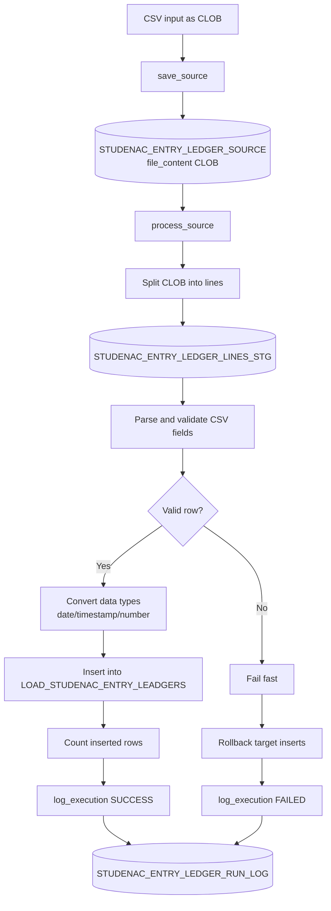

# Studenac CSV Loader

## Namen
Ta repozitorij dokumentira PL/SQL pristop za nalaganje CSV datotek v tabelo `LOAD_STUDENAC_ENTRY_LEADGERS` z dvostopenjskim tokom:
1. shrani celoten CSV kot source (`CLOB`),
2. v ločeni akciji obdela vrstice in izvede insert v cilj.

## Vhod/izhod
- Vhod: CSV vsebina kot `CLOB` in `file_name`.
- Vmesno: source zapis + staging vrstic + log izvedbe.
- Izhod: vrstice v `LOAD_STUDENAC_ENTRY_LEADGERS` in zapis statusa izvedbe.

## Arhitektura postopka
- Package: `PKG_STUDENAC_ENTRY_LEDGERS_LOAD`
- Source tabela: `STUDENAC_ENTRY_LEDGER_SOURCE`
- Staging tabela: `STUDENAC_ENTRY_LEDGER_LINES_STG`
- Log tabela: `STUDENAC_ENTRY_LEDGER_RUN_LOG`
- Ciljna tabela: `LOAD_STUDENAC_ENTRY_LEADGERS`

## Mermaid diagram celotnega izvajanja

## DDL in SQL artefakti
Predvidene SQL datoteke:
1. `sql/01_studenac_loader_tables.sql`
2. `sql/02_pkg_studenac_entry_ledgers_load.pks`
3. `sql/03_pkg_studenac_entry_ledgers_load.pkb`
4. `sql/04_studenac_loader_test_calls.sql`

## Operativni tok klicev
Možni javni klici:
1. `save_source(p_file_name, p_file_content, p_source_id out)`
2. `process_source(p_source_id, p_inserted_rows out, p_status out)`
3. `run(p_file_name, p_file_content, p_source_id out, p_inserted_rows out, p_status out)`
4. `log_execution(p_source_id, p_phase, p_status, p_started_at, p_finished_at, p_inserted_rows, p_error_code, p_error_message)`

`process_source` je namenoma ločen korak (druga akcija po shranitvi source).

## Logiranje in statusi
- Faze: `SAVE_SOURCE`, `PROCESS_SOURCE`, `RUN`
- Statusi: `STARTED`, `SUCCESS`, `FAILED`
- Obvezni atributi loga:
  - `started_at`
  - `finished_at`
  - `duration_ms`
  - `inserted_rows`
  - `status`
  - `error_code` in `error_message` (ob napaki)

## Napake in rollback pravila
- Način obdelave: `fail-fast`.
- Ob prvi napaki v vrstici se insert v cilj rollbacka.
- Source zapis ostane shranjen za ponoven zagon.
- Log napake se zapiše preko avtonomne transakcije.

## Testni scenariji
1. Veljaven CSV (primer v `examples/`) -> `SUCCESS`, pravilno število insertov.
2. Neveljaven datum -> `FAILED`, rollback inserta.
3. Neveljavno število stolpcev -> `FAILED`.
4. Decimalna vejica (quoted CSV) -> uspešna konverzija.
5. Ločena izvedba `save_source` in kasneje `process_source`.

## Omejitve in predpostavke
- Header vrstica se ne preskakuje avtomatsko.
- `id` iz CSV se ne inserta v cilj (uporabi se identity v tabeli).
- Parser podpira:
  - datume `YYYY-MM-DD` in `DD.MM.YYYY`,
  - timestamp `YYYY-MM-DD HH24:MI:SS` in `DD.MM.YYYY HH24:MI:SS`,
  - decimalno piko in decimalno vejico.
