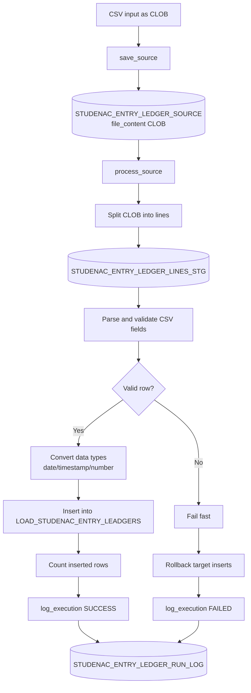

# Studenac CSV Loader

## Namjena
Ovaj repozitorij dokumentira PL/SQL pristup za učitavanje CSV datoteka u tablicu `LOAD_STUDENAC_ENTRY_LEADGERS` kroz dvostupanjski tok:
1. spremanje cijelog CSV-a kao izvora (`CLOB`),
2. obradu redaka u zasebnoj akciji i insert u ciljnu tablicu.

## Ulaz/izlaz
- Ulaz: CSV sadržaj kao `CLOB` i `file_name`.
- Međukorak: zapis izvora + staging redaka + log izvršenja.
- Izlaz: retci u `LOAD_STUDENAC_ENTRY_LEADGERS` i zapis statusa izvršenja.

## Arhitektura postupka
- Package: `PKG_STUDENAC_ENTRY_LEDGERS_LOAD`
- Source tablica: `STUDENAC_ENTRY_LEDGER_SOURCE`
- Staging tablica: `STUDENAC_ENTRY_LEDGER_LINES_STG`
- Log tablica: `STUDENAC_ENTRY_LEDGER_RUN_LOG`
- Ciljna tablica: `LOAD_STUDENAC_ENTRY_LEADGERS`

## Mermaid dijagram cijelog izvršavanja

## DDL i SQL artefakti
Predviđene SQL datoteke:
1. `sql/01_studenac_loader_tables.sql`
2. `sql/02_pkg_studenac_entry_ledgers_load.pks`
3. `sql/03_pkg_studenac_entry_ledgers_load.pkb`
4. `sql/04_studenac_loader_test_calls.sql`

## Operativni tok poziva
Mogući javni pozivi:
1. `save_source(p_file_name, p_file_content, p_source_id out)`
2. `process_source(p_source_id, p_inserted_rows out, p_status out)`
3. `run(p_file_name, p_file_content, p_source_id out, p_inserted_rows out, p_status out)`
4. `log_execution(p_source_id, p_phase, p_status, p_started_at, p_finished_at, p_inserted_rows, p_error_code, p_error_message)`

`process_source` je namjerno odvojen korak (druga akcija nakon spremanja source zapisa).

## Logiranje i statusi
- Faze: `SAVE_SOURCE`, `PROCESS_SOURCE`, `RUN`
- Statusi: `STARTED`, `SUCCESS`, `FAILED`
- Obavezni atributi loga:
  - `started_at`
  - `finished_at`
  - `duration_ms`
  - `inserted_rows`
  - `status`
  - `error_code` i `error_message` (u slučaju greške)

## Greške i rollback pravila
- Način obrade: `fail-fast`.
- Kod prve greške u retku radi se rollback inserta u cilj.
- Source zapis ostaje spremljen za ponovno pokretanje.
- Log greške se zapisuje kroz autonomnu transakciju.

## Testni scenariji
1. Valjan CSV (primjer u `examples/`) -> `SUCCESS`, ispravan broj inserta.
2. Nevaljan datum -> `FAILED`, rollback inserta.
3. Nevaljan broj stupaca -> `FAILED`.
4. Decimalni zarez (quoted CSV) -> uspješna konverzija.
5. Odvojeno izvršavanje `save_source`, a zatim `process_source`.

## Ograničenja i pretpostavke
- Header redak se ne preskače automatski.
- `id` iz CSV-a se ne inserta u cilj (koristi se identity u tablici).
- Parser podržava:
  - datume `YYYY-MM-DD` i `DD.MM.YYYY`,
  - timestamp `YYYY-MM-DD HH24:MI:SS` i `DD.MM.YYYY HH24:MI:SS`,
  - decimalnu točku i decimalni zarez.
